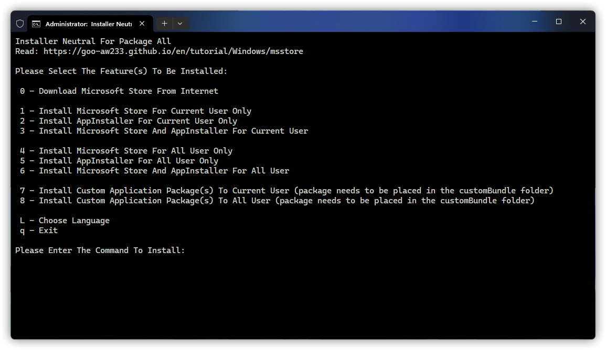

<h1 align="center">Install Microsoft Store To Windows</h1>

## Choose your language

Select your region and language to continue.

选择你的语言地区以继续。

[简体中文（中国大陆）](https://goo-aw233.github.io/zh-CN/tutorial/Windows/msstore) | [繁體中文（臺灣）](https://github.com/Goo-aw233/Add-Microsoft-Store) | [English (United States)](https://github.com/Goo-aw233/Add-Microsoft-Store)

## Usage

Select the latest version from [Releases](https://github.com/Goo-aw233/Add-Microsoft-Store/releases).

The following are the names corresponding to all versions of the application package.

x64:

Microsoft_Store_1_x64

> For Windows 10 Version 1709 x64 and higher, recommended for Windows 10 Version 1709 x64 - Windows 10 Version 1909 x64.

Microsoft_Store_1_without_Installer_x64

> For Windows 10 Version 1709 x64 and higher, recommended for Windows 10 Version 1709 x64 - Windows 10 Version 1909 x64, AppInstaller not included.

Microsoft_Store_2_x64

> For Windows 10 Version 2004 x64 and higher, recommended for Windows 10 Version 2004 x64 - Windows 10 Version 22H2 x64.

Microsoft_Store_2_without_Installer_x64

> For Windows 10 Version 2004 x64 and higher, recommended for Windows 10 Version 2004 x64 - Windows 10 Version 22H2 x64, AppInstaller not included.

Microsoft_Store_3_x64

> For Windows 11 Version 21H2 x64 and higher.

Microsoft_Store_3_without_Installer_x64

> For Windows 11 Version 21H2 x64 and higher, AppInstaller not included.

-----

x86:

Microsoft_Store_1_x86

> For Windows 10 Version 1709 x86 and higher, recommended for Windows 10 Version 1709 x86 - Windows 10 Version 1909 x86.

Microsoft_Store_1_without_Installer_x86

> For Windows 10 Version 1709 x86 and higher, recommended for Windows 10 Version 1709 x86 - Windows 10 Version 1909 x86, AppInstaller not included.

Microsoft_Store_2_x86

> For Windows 10 Version 2004 x86 and higher, recommended for Windows 10 Version 2004 x86 - Windows 10 Version 22H2 x86.

Microsoft_Store_2_without_Installer_x86

> For Windows 10 Version 2004 x86 and higher, recommended for Windows 10 Version 2004 x86 - Windows 10 Version 22H2 x86, AppInstaller not included.

-----

ARM:

Microsoft_Store_1_ARM

> For Windows 10 Version 1709 ARM32 and higher.

Microsoft_Store_1_without_Installer_ARM

> For Windows 10 Version 1709 ARM32 and higher, AppInstaller not included.

-----

ARM64:

Microsoft_Store_2_3_ARM64

> For Windows 10 Version 1709 ARM64 and higher.

Microsoft_Store_2_3_without_Installer_ARM64

> For Windows 10 Version 1709 ARM64 and higher, AppInstaller not included.

Download a package that best suits your system version and unzip it into a blank folder.

Afterwards, turn on <a href="ms-settings:developers">Developer Mode</a> in Settings.

How to turn on Developer Mode.

For Windows 10: Settings > Update & Security > For developers

For Windows 11: Settings > System > For developers (or Settings > Privacy & security > For developers)

Finally, double-click Runme.bat to agree to the UAC and select your language and installed components to start the installation.

## Download

[GitHub Releases](https://github.com/Goo-aw233/Add-Microsoft-Store/releases) | [OneDrive](https://gbcs6-my.sharepoint.com/:f:/g/personal/gucats_gbcs6_onmicrosoft_com/Eqlmdjx_hIpHqmxSLqmLjxoBdtfHYQ6qqe45GHF6TSB0OA)

## Q&A

### When will Windows 10 Version 1507 - Windows 10 1703 be supported?

In Windows 10 Version 1507 - Windows 10 1709,  Microsoft Store is no longer available and cannot be opened, so it is not supported for this version.

However, I'm trying to extract the corresponding Microsoft Store and AppInstaller packages from the corresponding Windows version.

## View application package information

[Packages](Packages.txt)

## Old Repository

[Old repository Link](https://github.com/Goo-aw233/Windows_Microsoft_Store)

The old repository has been migrated and is no longer updated and archived.

## Roadmap

### v3.2.0

- [ ] Support for all versions and all architectures in one package.

Completed

### v3.1.0

- [x] ARM64 and ARM32 will be supported.

