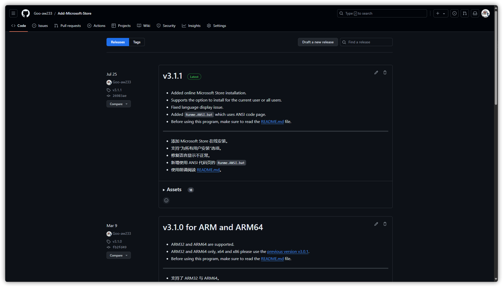

<h1 align="center">向 Windows 安装 Microsoft Store</h1>

## 选择语言

Select your region and language to continue.

选择你的语言地区以继续。

[English (United States)](https://github.com/Goo-aw233/Add-Microsoft-Store) | [简体中文 (中国大陆)](https://github.com/Goo-aw233/Add-Microsoft-Store/blob/main/README.zh-cn.md) | [繁體中文 (臺灣)](https://github.com/Goo-aw233/Add-Microsoft-Store)

## 使用方法

从 [Releases](https://github.com/Goo-aw233/Add-Microsoft-Store/releases) 下载最新版本的安装包。

以下是与所有版本的程序包相对应的名称。

x64:

Microsoft_Store_1_x64

> 适用于 Windows 10 版本 1709 x64 及更高版本，推荐用于 Windows 10 版本 1709 x64 到 Windows 10 版本 1909 x64。

Microsoft_Store_1_without_Installer_x64

> 适用于 Windows 10 版本 1709 x64 及更高版本，推荐用于 Windows 10 版本 1709 x64 到 Windows 10 版本 1909 x64，但不包括 AppInstaller。

Microsoft_Store_2_x64

> 适用于 Windows 10 版本 2004 x64 及更高版本，推荐用于 Windows 10 版本 2004 x64 到 Windows 10 版本 22H2 x64。

Microsoft_Store_2_without_Installer_x64

> 适用于 Windows 10 版本 2004 x64 及更高版本，推荐用于 Windows 10 版本 2004 x64 到 Windows 10 版本 22H2 x64，但不包括 AppInstaller。

Microsoft_Store_3_x64

> 适用于 Windows 11 版本 21H2 x64 及更高版本。

Microsoft_Store_3_without_Installer_x64

> 适用于 Windows 11 版本 21H2 x64 及更高版本，但不包括 AppInstaller。

-----

x86:

Microsoft_Store_1_x86

> 适用于 Windows 10 版本 1709 x86 及更高版本，推荐用于 Windows 10 版本 1709 x86 到 Windows 10 版本 1909 x86。

Microsoft_Store_1_without_Installer_x86

> 适用于 Windows 10 版本 1709 x86 及更高版本，推荐用于 Windows 10 版本 1709 x86 到 Windows 10 版本 1909 x86，但不包括 AppInstaller。

Microsoft_Store_2_x86

> 适用于 Windows 10 版本 2004 x86 及更高版本，推荐用于 Windows 10 版本 2004 x86 到 Windows 10 版本 22H2 x86。

Microsoft_Store_2_without_Installer_x86

> 适用于 Windows 10 版本 2004 x86 及更高版本，推荐用于 Windows 10 版本 2004 x86 到 Windows 10 版本 22H2 x86，但不包括 AppInstaller。

-----

ARM:

Microsoft_Store_1_ARM

> 适用于 Windows 10 版本 1709 ARM32 及更高版本。

Microsoft_Store_1_without_Installer_ARM

> 适用于 Windows 10 版本 1709 ARM32 及更高版本，但不包括 AppInstaller。

-----

ARM64:

Microsoft_Store_2_3_ARM64

> 适用于 Windows 10 版本 1709 ARM64 及更高版本。

Microsoft_Store_2_3_without_Installer_ARM64

> 适用于 Windows 10 版本 1709 ARM64 及更高版本，但不包括 AppInstaller。

下载最适合你系统版本的压缩包，并解压到空白文件夹中。

随后，在 Windows 设置中打开<a href="ms-settings:developers">开发人员模式</a>。

如何开启开发者模式。

Windows 10：Windows 设置 > 更新和安全 > 开发者选项

Windows 11：Windows 设置 > 系统 > 开发者选项 （或者 Windows 设置 > 隐私和安全性 > 开发者选项）

最后，双击 `Runme.bat`，同意 UAC 并选择语言和需要安装的组件后，即可开始安装。

## 下载

[GitHub Releases](https://github.com/Goo-aw233/Add-Microsoft-Store/releases) | [OneDrive](https://gbcs6-my.sharepoint.com/:f:/g/personal/gucats_gbcs6_onmicrosoft_com/Eqlmdjx_hIpHqmxSLqmLjxoBdtfHYQ6qqe45GHF6TSB0OA)

## Q&A

### 什么时候支持 Windows 10 版本 1507 到 Windows 10 版本 1703？

在 Windows 10 版本 1507 - Windows 10 1709 中，Microsoft Store 已不再可用且无法打开，因此该版本不再支持 Microsoft Store。

不过，我正试图从相应的 Windows 版本中提取相应的 Microsoft Store 和 AppInstaller 应用程序包。

## 浏览应用程序包部件单

[Packages](Packages.txt)

## 旧仓库

[旧仓库链接](https://github.com/Goo-aw233/Windows_Microsoft_Store)

旧资源库已迁移，不再更新，并作以存档。

## 路线导览

#### v3.2.0

- [ ] 在一个包中支持所有版本和所有架构。

### 近期完成

#### v3.1.1

- [x] 添加 Microsoft Store 在线安装。
- [x] 支持“为所有用户安装”选项。
- [x] 修复语言显示不正常。

早期完成

#### v3.1.0

- [x] 支持 ARM32 与 ARM64。

