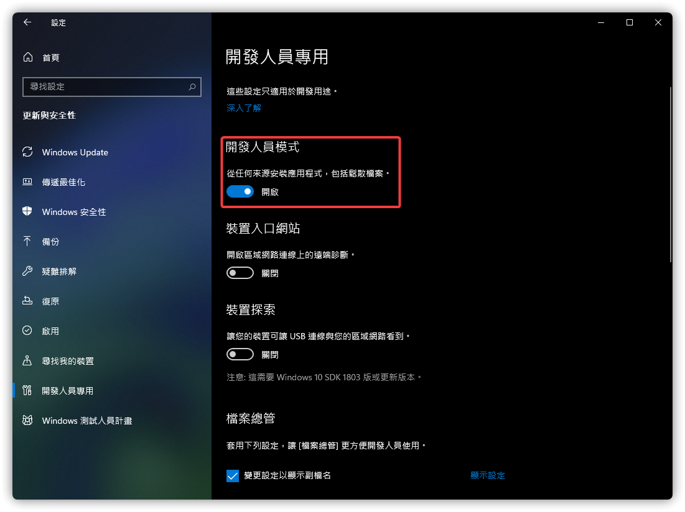
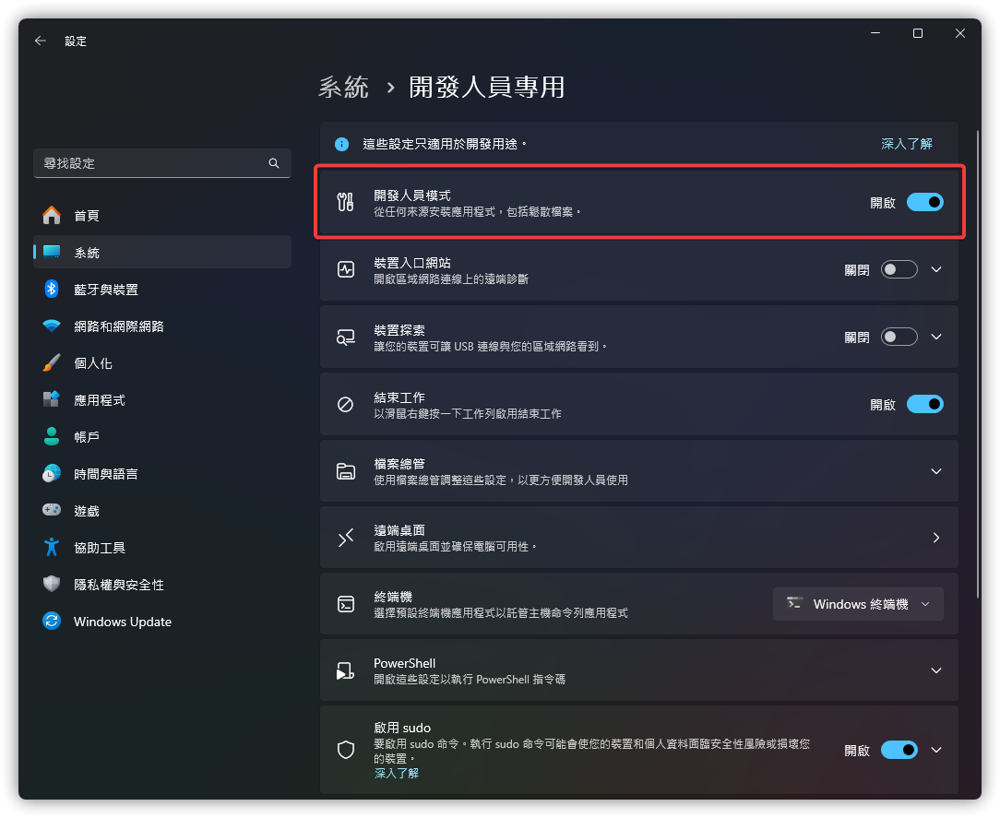
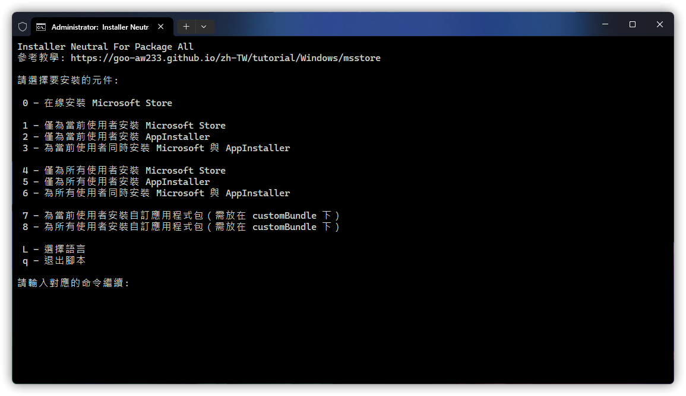

<h1 align="center">向 Windows 安裝 Microsoft Store</h1>

## 選擇語言

Select your region and language to continue.

選擇你的語言地區以繼續。

[English (United States)](https://github.com/Goo-aw233/Add-Microsoft-Store) | [簡體中文 (中國)](https://github.com/Goo-aw233/Add-Microsoft-Store/blob/main/README.zh-cn.md) | [繁體中文 (臺灣)](https://github.com/Goo-aw233/Add-Microsoft-Store/blob/main/README.zh-tw.md)

> [!IMPORTANT]
>
> `Runme.bat` 中暫未提供繁體中文

## 使用方法

從 [Releases](https://github.com/Goo-aw233/Add-Microsoft-Store/releases) 下載最新版本的安裝包。

以下是與所有版本的程序包相對應的名稱。

x64:

Microsoft_Store_1_x64

> 適用於 Windows 10 版本 1709 x64 及更高版本，推薦用於 Windows 10 版本 1709 x64 到 Windows 10 版本 1909 x64。

Microsoft_Store_1_without_Installer_x64

> 適用於 Windows 10 版本 1709 x64 及更高版本，推薦用於 Windows 10 版本 1709 x64 到 Windows 10 版本 1909 x64，但不包括 AppInstaller。

Microsoft_Store_2_x64

> 適用於 Windows 10 版本 2004 x64 及更高版本，推薦用於 Windows 10 版本 2004 x64 到 Windows 10 版本 22H2 x64。

Microsoft_Store_2_without_Installer_x64

> 適用於 Windows 10 版本 2004 x64 及更高版本，推薦用於 Windows 10 版本 2004 x64 到 Windows 10 版本 22H2 x64，但不包括 AppInstaller。

Microsoft_Store_3_x64

> 適用於 Windows 11 版本 21H2 x64 及更高版本。

Microsoft_Store_3_without_Installer_x64

> 適用於 Windows 11 版本 21H2 x64 及更高版本，但不包括 AppInstaller。

-----

x86:

Microsoft_Store_1_x86

> 適用於 Windows 10 版本 1709 x86 及更高版本，推薦用於 Windows 10 版本 1709 x86 到 Windows 10 版本 1909 x86。

Microsoft_Store_1_without_Installer_x86

> 適用於 Windows 10 版本 1709 x86 及更高版本，推薦用於 Windows 10 版本 1709 x86 到 Windows 10 版本 1909 x86，但不包括 AppInstaller。

Microsoft_Store_2_x86

> 適用於 Windows 10 版本 2004 x86 及更高版本，推薦用於 Windows 10 版本 2004 x86 到 Windows 10 版本 22H2 x86。

Microsoft_Store_2_without_Installer_x86

> 適用於 Windows 10 版本 2004 x86 及更高版本，推薦用於 Windows 10 版本 2004 x86 到 Windows 10 版本 22H2 x86，但不包括 AppInstaller。

-----

ARM:

Microsoft_Store_1_ARM

> 適用於 Windows 10 版本 1709 ARM32 及更高版本。

Microsoft_Store_1_without_Installer_ARM

> 適用於 Windows 10 版本 1709 ARM32 及更高版本，但不包括 AppInstaller。

-----

ARM64:

Microsoft_Store_2_3_ARM64

> 適用於 Windows 10 版本 1709 ARM64 及更高版本。

Microsoft_Store_2_3_without_Installer_ARM64

> 適用於 Windows 10 版本 1709 ARM64 及更高版本，但不包括 AppInstaller。

下載最適合你系統版本的壓縮包，並解壓到空白資料夾中。

隨後，在 Windows 設定中打開<a href="ms-settings:developers">開發人員專用</a>。

如何開啟開發人員專用。

Windows 10：Windows 設定 > 更新與安全性 > 開發人員專用

Windows 11：Windows 設定 > 系統 > 開發人員專用 （或者 Windows 設定 > 隱私權與安全性 > 開發人員專用）

最後，雙擊 `Runme.bat`，同意 UAC 並選擇語言和需要安裝的元件後，即可開始安裝。

## 下載

[GitHub Releases](https://github.com/Goo-aw233/Add-Microsoft-Store/releases) | [OneDrive](https://gbcs6-my.sharepoint.com/:f:/g/personal/gucats_gbcs6_onmicrosoft_com/Eqlmdjx_hIpHqmxSLqmLjxoBdtfHYQ6qqe45GHF6TSB0OA)

## 文件哈希值

[Hash](Hash.txt)

## Q&A

### 什麼時候支援 Windows 10 版本 1507 到 Windows 10 版本 1703？

在 Windows 10 版本 1507 - Windows 10 1709 中，Microsoft Store 已不再可用且無法打開，因此該版本不再支援 Microsoft Store。

不過，我正試圖從相應的 Windows 版本中提取相應的 Microsoft Store 和 AppInstaller 應用程式包。

## 瀏覽應用程式包部件單

[Packages](Packages.txt)

## 舊倉庫

[舊倉庫連結](https://github.com/Goo-aw233/Windows_Microsoft_Store)

舊資源庫已遷移，不再更新，並作以存檔。舊倉庫的文件已轉移到 [GitHub Releases](https://github.com/Goo-aw233/Add-Microsoft-Store/releases)。

## 路線導覽

#### v3.2.0

- [ ] 在一個包中支援所有版本和所有架構。

### 近期完成

#### v3.1.1

- [x] 添加 Microsoft Store 在線安裝。
- [x] 支援“為所有用戶安裝”選項。
- [x] 修復語言顯示不正常。

早期完成

#### v3.1.0

- [x] 支援 ARM32 與 ARM64。

